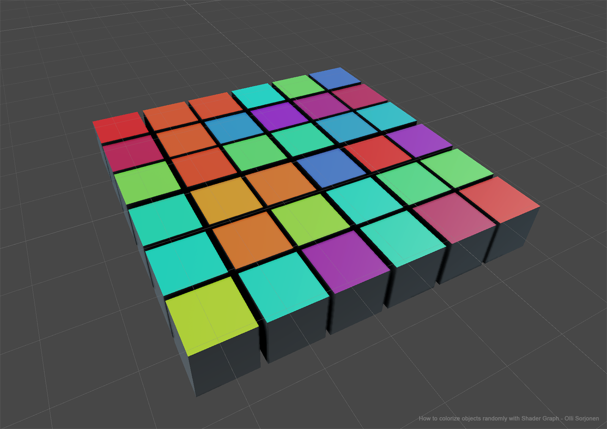
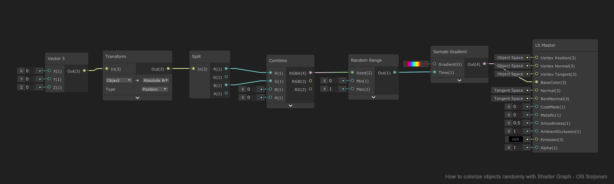

A simple shader setup how you can colorize objects in Unity with Shader Graph. 

Random number is generated for each object from their world space position, and this number is used to sample the gradient in different locations.

